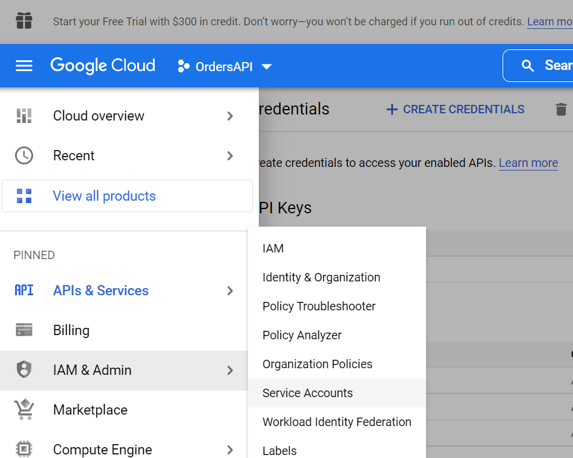
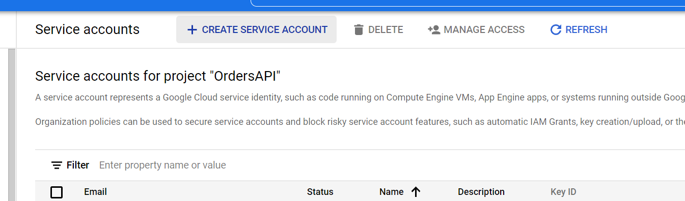

# Получение файла credentials.json из Google Console

## Создание ключей доступа.
1. Перейти в [консоль](https://console.cloud.google.com/welcome?project=ordersapi-358314) и выбрать проект, на который было выдано приглашение (ordersapi).
1. В левом верхнем углу нажать `Menu` > `APIs & Services` > `Credentials`.
1. Сверху нажать `Create Credentials` > `OAuth client ID`.
1. Выбрать `Application type` > `Desktop app`.
1. Выбрать имя для ключей.
1. Нажать `Create`
1. Скачать JSON с ключами доступа.

## Использование полученных ключей
1. Положить полученный JSON в корневую директорию проекта.
1. Переименовать файл в `credentials.json`

## Иллюстрации

